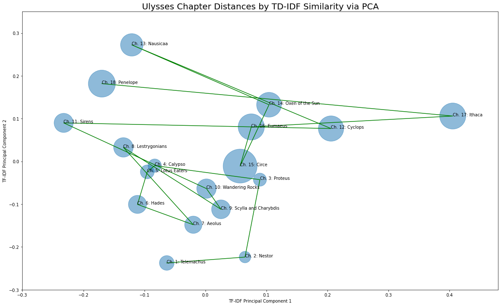

# Plot and Sentiment Visualization for Ulysses, by James Joyce
project by Brayton Hall

## Motivation
The aim of this project is to provide some proof of interdisciplinary collaboration between data science and literary criticism. Ulysses is the ideal novel for such a project, since its reputation, difficulty, and variety of themes is perfect for NLP analysis in conjuction with an already existing plethora of academic research on the novel, which can be used for both corroboration and as a starting off point for representing literary ideas mathematically or otherwise. 

The blog post covering this project [can be found on Medium](https://medium.com/swlh/using-nlp-to-visualize-ulysses-8a953c27aca?source=friends_link&sk=b2b87093818de9d886d4def56191df60).

The following image is a preliminary fruit of the project, which will eventually contain many types of visualization. It illustrates how each chapter can be vectorized using TF-IDF, converted into two dimensions using PCA, and plotted with lines connecting the chapters in chronological order. The sizes of the bubbles correspond to the word counts of each chapter. The code for that, and the preprocessing, can be found in the Jupyter notebook. The book was obtained from [Project Gutenberg](https://www.gutenberg.org/). 

## 
